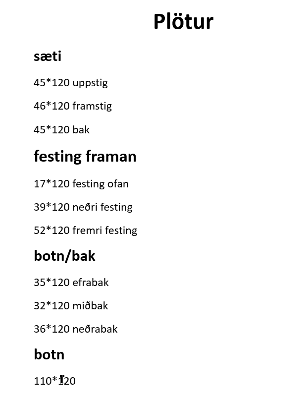

# jolasleði

Þessi jólasleði hefur verið smíðaður einnu sinni 2020 með gunskólanum á Suðureyri. En nú 2021 er verið að smíða 14 stk á vestfjörðum ásamt 1 stk á Neskaupstað. Öllum er velkomið að taka þetta efni og beturumbæta og smíða eftir þessum teikningum.

##Efnislisti
- Járn
- flatjárn og vinkiljárn
- Krosviður
- Grindarefni
- Gönguskíði
- Skraut
- Ljós skilti og fleira

#Verklisti
##Kjarna verkefni
- Járna grind
- Kassi

##Úlits verkefni
- Bólstun á sætum
- Led borðar
- stjórnborð

##Auka
- merki og skraut

eins og stendur er ekki til rafrásateikning

#Sneiðbynd af sleðanum

3D módel úr fusion 360

Stærðir á plötum inn í sleðanum

